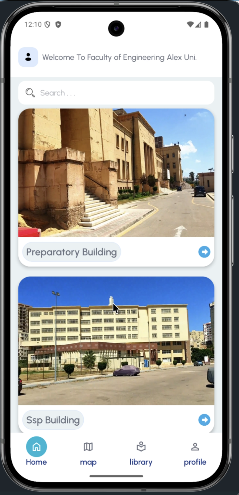
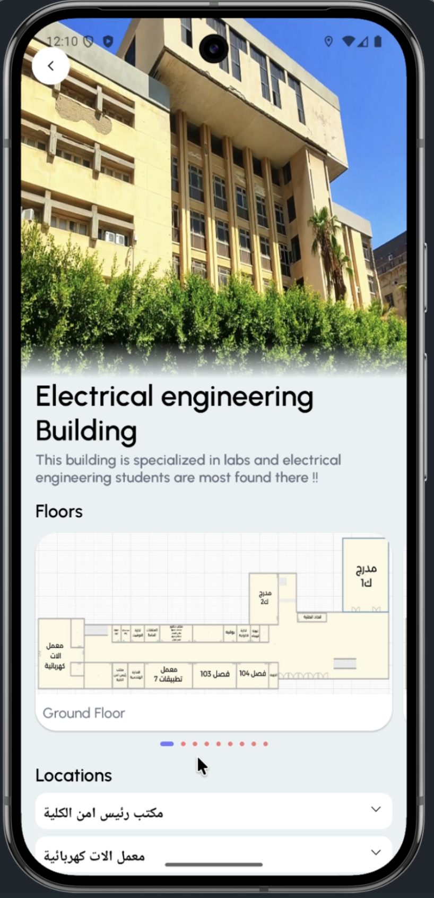
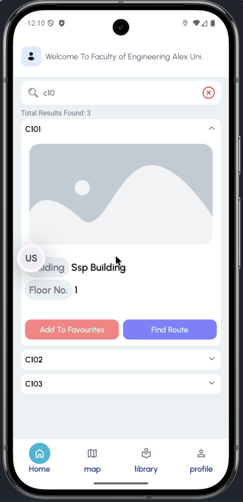
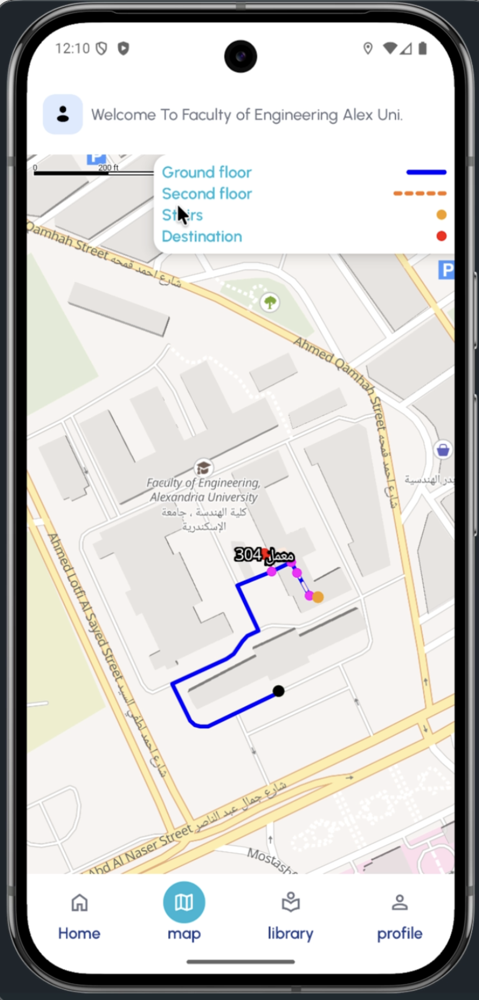

<p align="center">
  
</p>

<h1 align="center">INDO</h1>

<p align="center">
  An indoor and outdoor navigation system for university campuses — helping students and visitors easily locate buildings, classrooms, laboratories, and offices through an intuitive mobile application.
</p>

<p align="center">
  
  
  
  
</p>

---

## 📑 Table of Contents

- [Overview](#-overview)
- [Features](#-features)
  - [Building Explorer](#-building-explorer)
  - [Smart Search](#-smart-search)
  - [Outdoor Navigation](#️-outdoor-navigation)
  - [Indoor Navigation](#-indoor-navigation)
- [System Architecture](#️-system-architecture)
- [Mobile Application](#-mobile-application)
- [Backend](#️-backend)
- [Database](#️-database)
- [Maps](#️-maps)
- [Technologies Used](#-technologies-used)
- [Project Structure](#-project-structure)
- [Screenshots](#-screenshots)
- [Future Improvements](#-future-improvements)
- [Authors](#-authors)
- [License](#-license)

---

## 📖 Overview

**INDO** is a campus navigation platform designed to simplify getting around university campuses.

Unlike traditional map applications that only support outdoor navigation, INDO combines outdoor routing with a **custom indoor navigation system**, guiding users from their current location all the way to their destination inside a building.

The system consists of:

| Component | Technology |
|---|---|
| Mobile Application | Kotlin + Compose Multiplatform |
| Backend | Kotlin + Spring Boot |
| Database | Supabase |
| Outdoor Routing | Geoapify |

---

## ✨ Features

### 🏢 Building Explorer

Browse all faculty buildings through an interactive home screen. Each building includes:

- Building image and description
- Available floors and floor maps
- Classes, laboratories, and offices on each floor

<p align="center">
  
  
</p>

### 🔍 Smart Search

Search for classrooms, laboratories, and offices with:

- Arabic and English search
- Fast filtering
- Direct navigation to the selected destination

<p align="center">
  
</p>

### 🗺️ Outdoor Navigation

Powered by the **Geoapify Routing API**, the application:

1. Detects the user's current location
2. Calculates the shortest path to the destination building
3. Guides the user to the entrance (gate) of the selected building

### 🧭 Indoor Navigation

INDO implements a custom indoor navigation solution built specifically for university buildings. Instead of relying on expensive indoor positioning hardware, it uses a **checkpoint-based navigation system**.

Each building floor is represented as a graph of connected checkpoints. The navigation engine:

1. Determines the user's approximate position
2. Finds the nearest checkpoint
3. Computes the shortest path between checkpoints
4. Guides the user until they reach the destination

Two approaches are supported for user positioning:

- **Wi-Fi Router Detection** — uses nearby Wi-Fi access points to estimate location where hardware infrastructure is available.
- **GPS Approximation** — uses GPS coordinates mapped to the nearest checkpoint when Wi-Fi positioning is unavailable.


<p align="center">
  
</p>
---

## 🏗️ System Architecture

```
┌───────────────────────┐
│      Mobile App        │
│ Compose Multiplatform  │
└───────────┬────────────┘
            │ Ktor Client
┌───────────▼────────────┐
│  Kotlin Spring Boot     │
│       Backend           │
└───────────┬────────────┘
            │
┌───────────▼────────────┐
│  Supabase Database      │
└───────────┬────────────┘
            │
   ┌────────┴────────┐
   │                 │
┌──▼─────────┐  ┌────▼───────┐
│ Geoapify   │  │ Campus     │
│ API        │  │ Data       │
└────────────┘  └────────────┘
```

---

## 📱 Mobile Application

### Tech Stack

- Kotlin
- Compose Multiplatform (CMP/KMP)
- Jetpack Compose
- Ktor
- MVVM
- Clean Architecture
- MapLibre
- Location Services
- Wi-Fi Manager
- Coroutines / Flow

### Mobile Architecture

The application follows **Clean Architecture**:

```
Presentation
├── UI
├── ViewModels
└── UI State

Domain
├── Repository Interfaces
└── Models

Data
├── Repositories
├── Remote Data Sources
├── DTOs
└── Mappers
```

---

## ⚙️ Backend

Built using **Kotlin** and **Spring Boot**. Responsibilities include:

- API endpoints
- Database communication
- Building & floor management
- Search endpoints
- Navigation data
- Geoapify integration

---

## 🗄️ Database

**Provider:** Supabase

Stores:

- Buildings, floors, classrooms, laboratories, offices
- Checkpoints and indoor graph connections
- Navigation metadata

---

## 🗺️ Maps

- **MapLibre** — renders maps
- **Geoapify Routing API** — calculates outdoor routes

---

## 🚀 Technologies Used

| Category | Technologies |
|---|---|
| Language | Kotlin |
| UI | Jetpack Compose, Compose Multiplatform |
| Architecture | Clean Architecture, MVVM |
| Networking | Ktor |
| Backend | Spring Boot |
| Database | Supabase |
| Maps | MapLibre |
| Outdoor Navigation | Geoapify |
| Location | Android Location Services |
| Indoor Positioning | Wi-Fi Manager + GPS Approximation |

---

## 📸 Screenshots

| Home | Building Details |
|:---:|:---:|
|  |  |

| Search | Outdoor Navigation |
|:---:|:---:|
|  |  |

---

## 🎯 Future Improvements

- [ ] Voice-guided navigation
- [ ] Accessibility support for visually impaired users
- [ ] Real-time indoor positioning using BLE beacons
- [ ] Multi-campus support
- [ ] Crowd-aware routing
- [ ] Offline campus maps
- [ ] Estimated walking time for indoor navigation
- [ ] Personalized user features

---

## 👨‍💻 Authors

Developed as a Graduation Project by:

- Yousef Osama
- Ahmed Ibrahim

---

## 📄 License

This project was developed for educational purposes as a graduation project.